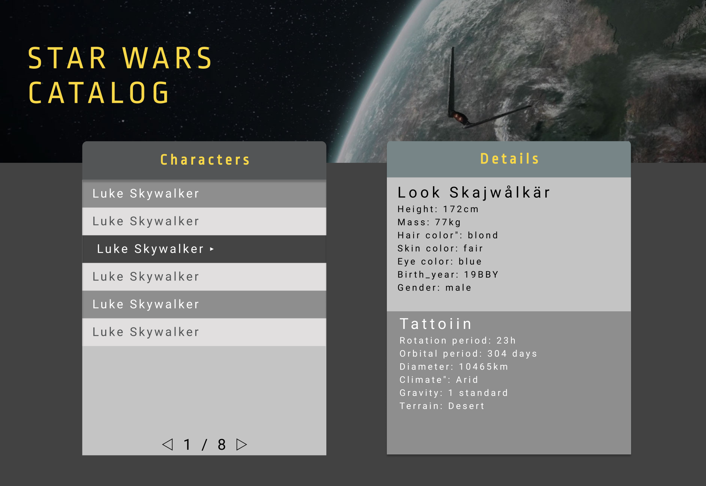

# Slutprojekt
## Star Wars Catalog

## Mockup
> [Star Wars Catalog Mockup PDF](star-wars-catalog-mockup.pdf)

## Webbtjänst
SWAPI: The Star Wars API
https://swapi.dev

## Beskrivning
Ni ska bygga en webbplats för en katalog över Star Wars karaktärer.

## Specifikation
* En lista på karaktärer som hämtas från https://swapi.dev
* Listan ska vara paginerad
* När man klickar på en karaktär i listan ska information om den karaktären visas i den andra boxen
* Medans en request håller på laddar ska en preloader visas i respektive låda
* Styling enligt mock, flasha med lite transitions

## Instruktioner
1. En i gruppen forkar det här repot. Lägg till den andra medlemmen på repot.
1. Gör en komponentanalys, dokumentera detta
1. Gör en planering, vad och vilken ordning ska allt göras, dokumentera detta
1. Bestäm när, var och hur ni träffas
1. Start developing! Gör commits ofta och glöm inte att pusha till repot.

## Tekniker
* DOM-Interaktion och Manipulation
* Events
* Asynkron programmering och Promises
* Interaktion med webbtjänst
* De fem grundpelarna

## Bedömning
* Kodstruktur och kodkvalité
* Buggmängd
* Hur väl ni visar förståelse för teknikerna

## Level Up - VG-kravet

### Ytterligare specifikation
Boxxen till höger ska ha 4 olika lägen som man kan växla mellan med tabbar(se mock).

Informationen i varje box behöver hämtas från olika Endpoints från swapi.dev.